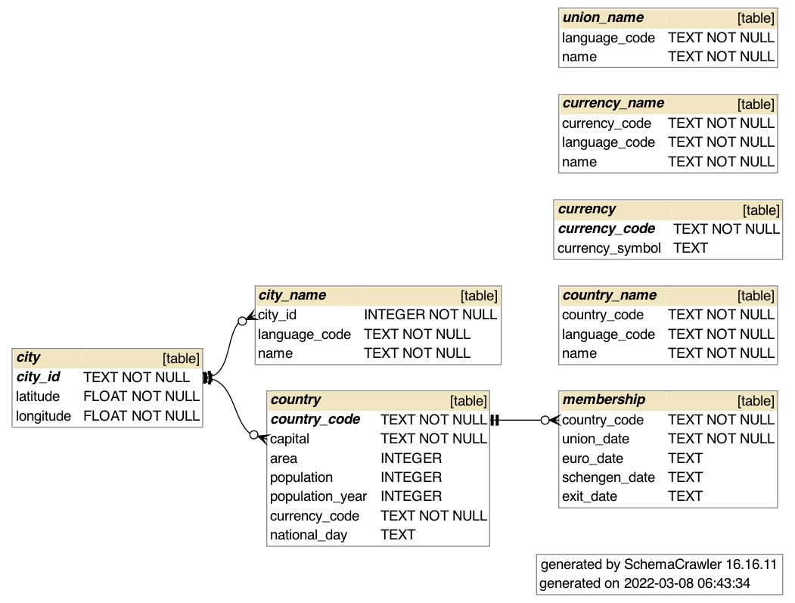

# EU Member Country Data

This repository contains some data files and utilities related to the member
countries of the European Union.

While every attempt has been made to ensure that the data is correct,
there may be errors. Use these data at your own risk.

Some of the data originates from the European Union website, mainly the
[EU Member Countries](http://europa.eu/about-eu/countries/member-countries/index_en.htm)
page.

## Data format

The raw data is in CSV files, in the UTF-8 character encoding.
As per [RFC 4180](https://tools.ietf.org/html/rfc4180),
the files use a CR LF line delimiter. They also have a header row,
used to indicate database column names for further use.

The `country_code` column values are the ISO 3166-1 Alpha-2 codes of the countries,
with the following exceptions due to common usage by the European Commission:
Greece is represented with `EL`instead of `GR`, and the United Kingdom is
represented with `GB` instead of `UK`.

The `language_code` column values are the ISO 639-1 Alpha-2 codes of the languages.

The CSV data files are:
* `city_name.csv` -- the names of the capital cities in all official EU languages
* `city.csv`  -- coordinates of the capital cities
* `country_name.csv` -- the names of the member countries in all official EU languages
* `country.csv` -- information about the member countries
* `membership.csv` -- country-specific dates for joining the union, the eurozone etc., also exit
* `union_name.csv` -- the name of the EU in all official EU languages

## Creating the database

You can use the `create.sql` script to create an SQLite 3 database.
However, the script does not populate the database. For that you can use
the `populate.py` Python script (see below).

On macOS the `sqlite3` utility is already on your system. To install
SQLite on Windows, see the [instructions](https://www.sqlite.org/cli.html).

To create the database, open a terminal window and issue the command

`sqlite3 eumemberdata.sqlite3`

This starts up the SQLite console, where you can read and execute the
database definition statements from the SQL file, like this:

`.read create.sql`

After executing the SQL, you can issue the `.schema` command to check that
the database tables have been created. You should see more or less the
same as in the script (minus the comments).

Enter the `.quit` command to return to the shell.

## Populating the database

### Using a Python script

Use the Python script `populate.py` to add rows to the database:

`python3 populate.py`

You should see roughly the following output:

```
Processing country.csv
Processing country_name.csv
Processing city.csv
Processing city_name.csv
Processing union_name.csv
Processing membership.csv
Done.
```

The script requires Python 3.

When you open the database file again, you should be able to make queries
against the data:

```
% sqlite3 eumemberdata.sqlite3
SQLite version 3.32.3 2020-06-18 14:16:19
Enter ".help" for usage hints.
sqlite> select country_code, exit_date from membership where exit_date != '';
GB|2020-01-31
```

### Using the sqlite3 command-line tool

The `sqlite3` command-line tool can import data from CSV files into database tables.
However, it treats the files differently depending on whether the table already
exists or not.

We'd like to create all the database tables first with our creation SQL script, and import the data separately. Because the CSV files in this repository have a header row with the column names, we need to instruct `sqlite3` to skip the first row.

Ensure that you have created the database and all the tables as detailed above,
and that the database is empty. To prevent constraint violations, issue the SQL
command:

```
PRAGMA foreign_keys=ON;
```

Then enter the following commands in the sqlite3 tool:

```
.import --csv --skip 1 city.csv city
.import --csv --skip 1 city_name.csv city_name
.import --csv --skip 1 country.csv country
.import --csv --skip 1 country_name.csv country_name
.import --csv --skip 1 union_name.csv union_name
.import --csv --skip 1 membership.csv membership
```

The order is important here, because you can't create countries before their
capital cities exist, and so on.

Verify that the data has been imported into the database with a SELECT statement
such as:

```
SELECT country_code FROM country;
```

### With SQL INSERT statements

Ensure that the database and the tables have been created, for example
using the `create.sql` file in `sqlite3` (see above).

Read the file `populate.sql` into the `sqlite3` tool:

`.read populate.sql`

## Example queries

Here are some example queries to the database. You may want to adjust the
display options of `sqlite3`:

```
.mode table
.headers on
```

Find all the names of the current or historic EU member countries
in a given language (indicated by its ISO 639-1 Alpha-2 code),
in this case English:

```
SELECT country_name.country_code, name FROM country_name
JOIN country ON country.country_code = country_name.country_code
WHERE language_code = 'en';
```

Get all the current member countries (note that missing dates are currently
indicated by empty strings, not NULL values):

```
SELECT country_code FROM membership WHERE exit_date = '';
```

Note that the result set should not contain `GB`, because Great Britain
has exited the European Union.

Get the English language names of all the current member countries in English:

```
SELECT name FROM country_name
JOIN (SELECT country_code FROM membership WHERE exit_date = '') AS current_member
    ON country_name.country_code = current_member.country_code
WHERE language_code = 'en';
```

Get the country codes and capital IDs of all the countries:

```
SELECT country_code, capital FROM country
JOIN city ON country.capital = city.city_id;
```

Get the English language names of all the capital cities:

```
SELECT name FROM city_name
WHERE language_code = 'en';
```

Get the English names of the countries and their capitals:

```
SELECT co_name, ci_name FROM

(SELECT country_name.country_code, name as co_name, capital FROM country_name
JOIN country ON country.country_code = country_name.country_code
WHERE language_code = 'en') AS all_countries

JOIN

(SELECT capital.city_id, capital.name AS ci_name FROM country
  JOIN (SELECT city_id, name FROM city_name WHERE language_code = 'en') AS capital
    ON country.capital = capital.city_id) AS all_capitals

ON all_countries.capital = all_capitals.city_id;
```

## Generating an ER diagram

You can use [SchemaCrawler](https://www.schemacrawler.com/index.html) to generate
an Entity-Relationship (ER) diagram from the database schema. (When designing a
database, it is probably better to start with an ER diagram, and then proceed to
define the schema based on that.)

This [Bash script](https://gist.github.com/dannguyen/f056d05bb7fec408bb7c14ea1552c349#file-script-schemacrawler-on-macos-sh)
can be used to install SchemaCrawler locally, so that you can invoke it simply with the
command `schemacrawler` and the necessary options.

The ER diagram of the database in PNG format can be created with the following command:

```
schemacrawler --server sqlite --database=eumemberdata.sqlite3 \
    --info-level=standard --command=schema \
    --outputformat=png --output-file=eumemberdata-schema.png
```

This is the result:



## JSON output

To use the EU member data in a mobile application, the aim is to make
a JSON file with the following format:

```json
{"countries":[
    {
      "code": "FI",
      "name": {
        "en": "Finland",
        "fi": "Suomi"
      },
      "capital": {
        "name": {
          "en": "Helsinki",
          "fi": "Helsinki"
        },
        "coordinate": {
          "longitude": 24.9375,
          "latitude": 60.1708
        }
      },
      "area": 338435,
      "population": {
        "population": 5451270,
        "year": 2014
      },
      "currency": "EUR",
      "joined": {
        "union": "1995-01-01",
        "euro": "1999-01-01",
        "schengen": "2001-03-25"
      }
    }
]}
```

The above sample is abbreviated; the final JSON should include names for
the countries and cities in all the languages.

Use the Python script `generate.py` to generate a JSON document with
all the information in the database.

## Timeline of EU events

This repository contains several implementations of a timeline of EU events, written in
Python, Kotlin, Swift and Rust.

An example of the timeline:

```
1958-01-01: Belgium, France, Germany, Italy and Netherlands joined the EU.
1973-01-01: Denmark, Ireland and United Kingdom joined the EU.
1981-01-01: Greece joined the EU.
1986-01-01: Portugal and Spain joined the EU.
1995-01-01: Austria, Finland and Sweden joined the EU.
1995-03-26: Belgium, France, Germany, Luxembourg, Netherlands, Portugal and Spain joined the Schengen agreement.
1997-10-26: Italy joined the Schengen agreement.
1999-01-01: Austria, Belgium, Finland, France, Germany, Ireland, Italy, Luxembourg, Netherlands, Portugal and Spain joined the Eurozone.
2000-01-01: Greece joined the Schengen agreement.
2001-01-01: Greece joined the Eurozone.
2001-03-25: Denmark, Finland and Sweden joined the Schengen agreement.
2004-01-01: Estonia and Hungary joined the EU.
2004-05-01: Cyprus, Czech Republic, Latvia, Lithuania, Luxembourg, Malta, Poland, Slovakia and Slovenia joined the EU.
2007-01-01: Slovenia joined the Eurozone. Bulgaria and Romania joined the EU.
2007-12-01: Austria, Czech Republic, Estonia, Hungary, Latvia, Lithuania, Malta, Poland, Slovakia and Slovenia joined the Schengen agreement.
2008-01-01: Cyprus and Malta joined the Eurozone.
2009-01-01: Slovakia joined the Eurozone.
2011-01-01: Estonia joined the Eurozone.
2013-07-01: Croatia joined the EU.
2014-01-01: Latvia joined the Eurozone.
2015-01-01: Lithuania joined the Eurozone.
2020-01-31: United Kingdom exited the EU.
```

*Challenge:* Can you implement this timeline in SQL?
