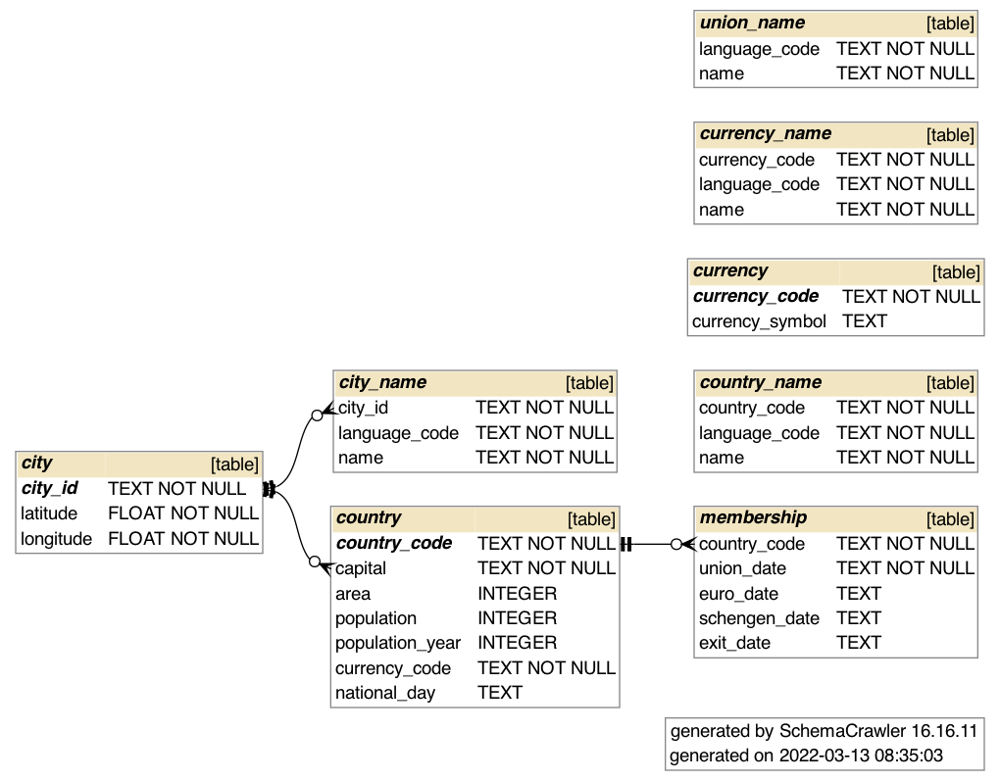

# EU Member Country Data

This repository contains some data files and utilities related to the member
countries of the European Union.

While every attempt has been made to ensure that the data is correct,
there may be errors. Use these data at your own risk.

Some of the data originates from the European Union website, mainly the
[EU Member Countries](http://europa.eu/about-eu/countries/member-countries/index_en.htm)
page.

## Data format

The raw data is in CSV files, in the UTF-8 character encoding.
As per [RFC 4180](https://tools.ietf.org/html/rfc4180),
the files use a CR LF line delimiter. They also have a header row,
used to indicate database column names for further use.

The `country_code` column values are the ISO 3166-1 Alpha-2 codes of the countries,
with the following exceptions due to common usage by the European Commission:
Greece is represented with `EL`instead of `GR`, and the United Kingdom is
represented with `GB` instead of `UK`.

The `language_code` column values are the ISO 639-1 Alpha-2 codes of the languages.

The CSV data files are:
* `city_name.csv` -- the names of the capital cities in all official EU languages
* `city.csv`  -- coordinates of the capital cities
* `country_name.csv` -- the names of the member countries in all official EU languages
* `country.csv` -- information about the member countries
* `membership.csv` -- country-specific dates for joining the union, the eurozone etc., also exit
* `union_name.csv` -- the name of the EU in all official EU languages

## Database creation

You can use the `eumemberdata.sql` script to create an SQLite 3 database.
However, the script does not populate the database. For that you can use
the `populate.py` Python script (see below).

On macOS the `sqlite3` utility is already on your system. To create the
database, open a shell with Terminal and issue the command

`sqlite3 eumemberdata.sqlite3`

This starts up the SQLite console, where you can read and execute the
database definition statements from `eumemberdata.sql`, like so:

`.read eumemberdata.sql`

After executing the SQL, you can issue the `.schema` command to check that
the database tables have been created. You should see more or less the
same as in `eumemberdata.sql` script (minus the comments).

Enter the `.quit` command to return to the shell.

## Populating the database

Use the Python script `populate.py` to add rows to the database:

`python3 populate.py`

You should see roughly the following output:

```
Processing country.csv
Processing country_name.csv
Processing city.csv
Processing city_name.csv
Processing union_name.csv
Processing membership.csv
Done.
```

The script requires Python 3.

When you open the database file again, you should be able to make queries
against the data:

```
% sqlite3 eumemberdata.sqlite3
SQLite version 3.32.3 2020-06-18 14:16:19
Enter ".help" for usage hints.
sqlite> select country_code, exit_date from membership where exit_date != '';
GB|2020-01-31
```

## Generating ER diagram

You can use [SchemaCrawler](https://www.schemacrawler.com/index.html) to generate
an Entity-Relationship (ER) diagram from the database schema. (When designing a
database, it is probably better to start with an ER diagram, and then proceed to
define the schema based on that.)

This [Bash script](https://gist.github.com/dannguyen/f056d05bb7fec408bb7c14ea1552c349#file-script-schemacrawler-on-macos-sh)
can be used to install SchemaCrawler locally, so that you can invoke it simply with the
command `schemacrawler` and the necessary options.

The ER diagram of the database in PNG format can be created with the following command:

```
schemacrawler --server sqlite --database=eumemberdata.sqlite3 \
    --info-level=standard --command=schema \
    --outputformat=png --output-file=eumemberdata-schema.png
```

This is the result:



## JSON output

To use the EU member data in a mobile application, the aim is to make
a JSON file with the following format:

```json
{"countries":[
    {
      "code": "FI",
      "name": {
        "en": "Finland",
        "fi": "Suomi"
      },
      "capital": {
        "name": {
          "en": "Helsinki",
          "fi": "Helsinki"
        },
        "coordinate": {
          "longitude": 24.9375,
          "latitude": 60.1708
        }
      },
      "area": 338435,
      "population": {
        "population": 5451270,
        "year": 2014
      },
      "currency": "EUR",
      "joined": {
        "union": "1995-01-01",
        "euro": "1999-01-01",
        "schengen": "2001-03-25"
      }
    }
]}
```

The above sample is abbreviated; the final JSON should include names for
the countries and cities in all the languages.

Use the Python script `generate.py` to generate a JSON document with
all the information in the database.

## REST API

The data is also available as a REST API at https://eumemberdata.herokuapp.com.

# Deploying to Heroku

Create a Heroku app as described in the Heroku Dev Center notes for Python at https://devcenter.heroku.com/categories/python-support.

For example, the REST API app was created with the Heroku CLI like this:

`heroku apps:create eumemberdata --region eu`

Prepare for deployment by creating a `Procfile`, installing the required libraries
into your Python virtual environment, and collecting the
libraries into `requirements.txt` with `pip`.

# Preparing the PostgreSQL database

The SQLite database is intended for mobile apps. In Heroku web apps SQLite is not an option for the database, since it requires a persistent database file. Instead, you can use the Heroku PostgreSQL add-on.

The database for the REST API was created with:

`heroku addons:create heroku-postgresql:hobby-dev`

Heroku saves the URL of the database into your app as the `HEROKU_DATABASE_BRONZE_URL`
environment variable. The REST API app refers to this value.

The database table create statements for SQLite should work as is for PostgreSQL. Use the `psql` command
to create the tables.

To populate the database after you have created the tables, you can import the CSV files using the psql
\copy command, like so:

    \copy city from 'city.csv' with csv header

Execute a similar command for each CSV file city, country, membership, union_name, city_name, country_name.
